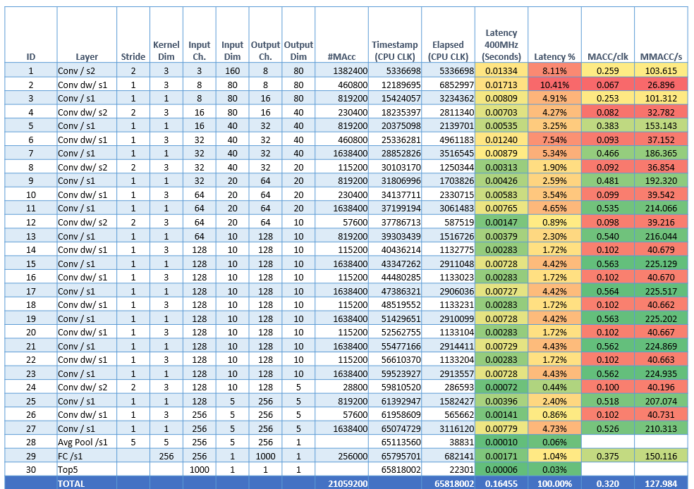

# Mobilenet V1 for STM32 over CMSIS-NN

This project contains an STM32 application for executing a quantized Mobilenet v1 (`160x160x3`, alpha `0.25`) trained for Imangenet on a STM32H7 NUCLEO evaluation board.

## Support and Contribution
If you want to collaborate, contribute, or to rise *issues* and suggestions to this project you can use the [Issues](https://github.com/EEESlab/mobilenet_v1_stm32_cmsis_nn/issues) page or contact us:
+ **Alessandro Capotondi**, *University of Bologna*, [email](mailto:alessandro.capotondi@unibo.it)
+ **Manuele Rusci**, *University of Bologna*, [email](mailto:alessandro.capotondi@unibo.it)

## What is a Mobilenet?
[MobileNets](https://arxiv.org/abs/1704.04861) are small, low-latency, low-power models parameterized to meet the resource constraints of a variety of use cases. They can be built upon for classification, detection, embeddings and segmentation similar to how other popular large scale models, such as Inception, are used. MobileNets can be run efficiently on mobile devices with [TensorFlow Mobile](https://www.tensorflow.org/mobile/).
MobileNets trade off between latency, size and accuracy while comparing favorably with popular models from the literature.

  

Only a limitated set of configurations for MobileNet can be hosted on a ST32H7 device, memory limitation are there (2MB flash + 512kB L2 SRAM). The following chart highlights the subset of configurations compatible for the device.

  

The parameters used on this project is image input `160x160x3` and alpha `0.25`. The following table show the classification performance of such configuration.

Model  | Million MACs | Million Parameters | Top-1 Accuracy| Top-5 Accuracy |
:----:|:------------:|:----------:|:-------:|:-------:|
[MobileNet_v1_0.25_160_uint8](http://download.tensorflow.org/models/mobilenet_v1_2018_08_02/mobilenet_v1_0.25_160_quant.tgz)|21|0.47|43.4|68.5|

### UINT8 Asymmetric Quantization for CMSIS-NN
To limit the classification error introduced by the quantization this Mobilenet implementation uses our extended [CMSIS-NN](https://github.com/EEESlab/CMSIS_NN-INTQ) that support an *Asymmetric Quantization* methodology mapped on *UINT8* datatypes.
You find additional information on this [article](https://medium.com/@manuele.rusci/running-mobilenet-on-stm32-mcus-at-the-edge-e217db934f83).

### How to import a new Tensorflow model
Shortly we will release a Python script for the import of pre-trained Tensorflow models.

## Getting-Started on STM Workbench
+ Get a STMicroelectronics [NUCLEO STM32H743ZI](https://www.st.com/en/evaluation-tools/nucleo-h743zi.html)
+ Install [System Workbench for STM32](https://www.st.com/en/development-tools/sw4stm32.html) for your OS and open it
+ Click `File> Import...`, then select `Git> Project from Git` and click the button `Next`

  

+ Select `Clone URI` and click the button `Next`

  

+ Add the URI `https://github.com/EEESlab/mobilenet_v1_stm32_cmsis_nn.git` and click `Next`

  

+ Select all the branches and click the button `Next`

  

+ Select the local destination and click the button `Next`

  

+ Select how to import the project and click the button `Next`

  

+ Import the project (finally)!

  

+ Build and run the application!

## Measured Performance
The following table show the profiling layer-per-layer of this Mobilenet implementation on the STM32H7 running at 400MHz.

  

## Limitations
+ The project supports only STM32H7 board.
+ Input image is statically linked at compile time.

